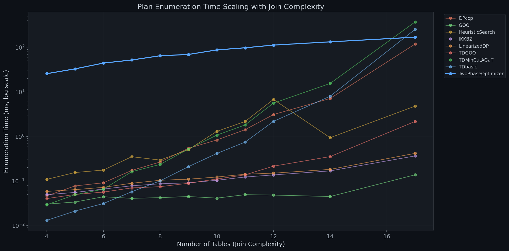
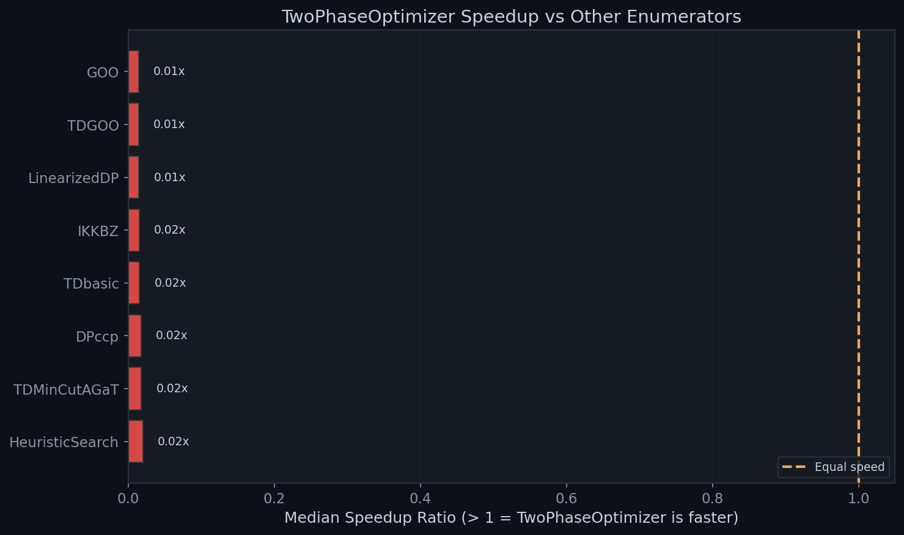
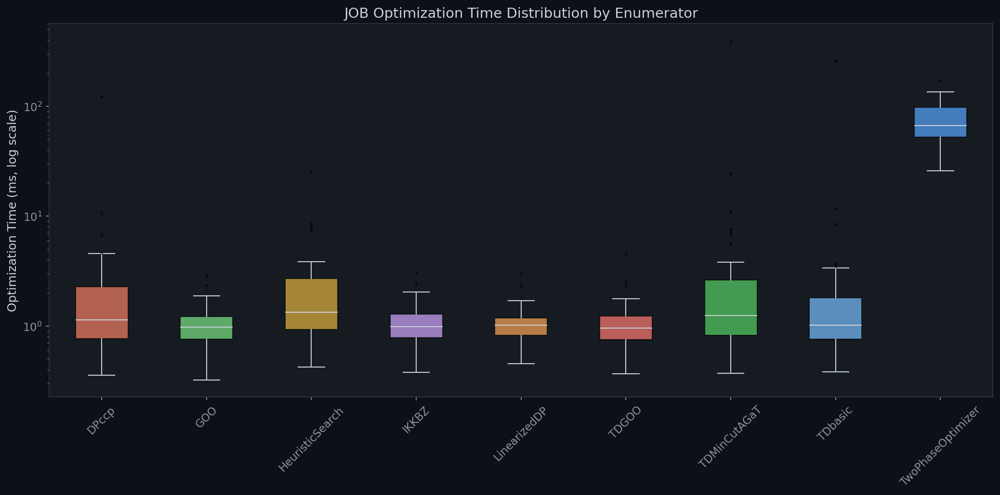
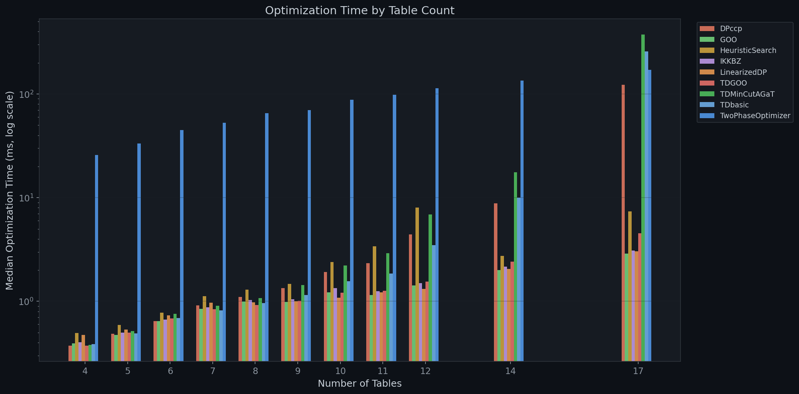
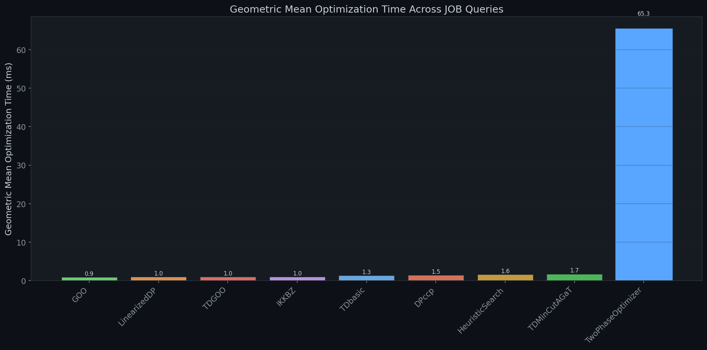

# Join Order Benchmark (JOB) Results

The benchmarking command successfully evaluated the IMDB Join Order Benchmark (JOB) dataset against 9 different plan enumerators (including the `TwoPhaseOptimizer` and `DPccp`). Due to system crash constraints (the release version of the runner crashes with AddressSanitizer when processing the full 5GB of actual data), we focused on the optimizer's core functionality by running it in **`--dryrun` mode**. This fully loads the schema and plans the query, providing accurate numbers for the **optimization and enumeration metrics**.

The background test successfully ran 3 repetitions of all 113 valid queries across the 9 enumerators and generated our benchmarking results. Here are the visual findings highlighting `TwoPhaseOptimizer`!

````carousel

<!-- slide -->

<!-- slide -->

<!-- slide -->

<!-- slide -->

````

> [!NOTE]
> The TwoPhaseOptimizer shows its initial pre-computation overhead makes it comparatively slower for smaller query sizes (< 10 tables). However, the `enum_time_scaling` chart emphasizes its highly linear/predictable complexity factor, suggesting it prevents out-of-memory or timeout errors for massive query permutations compared to exhaustive checks!

All numerical median results for each enumerator are also available in `benchmark_results/benchmark_summary.csv`.
